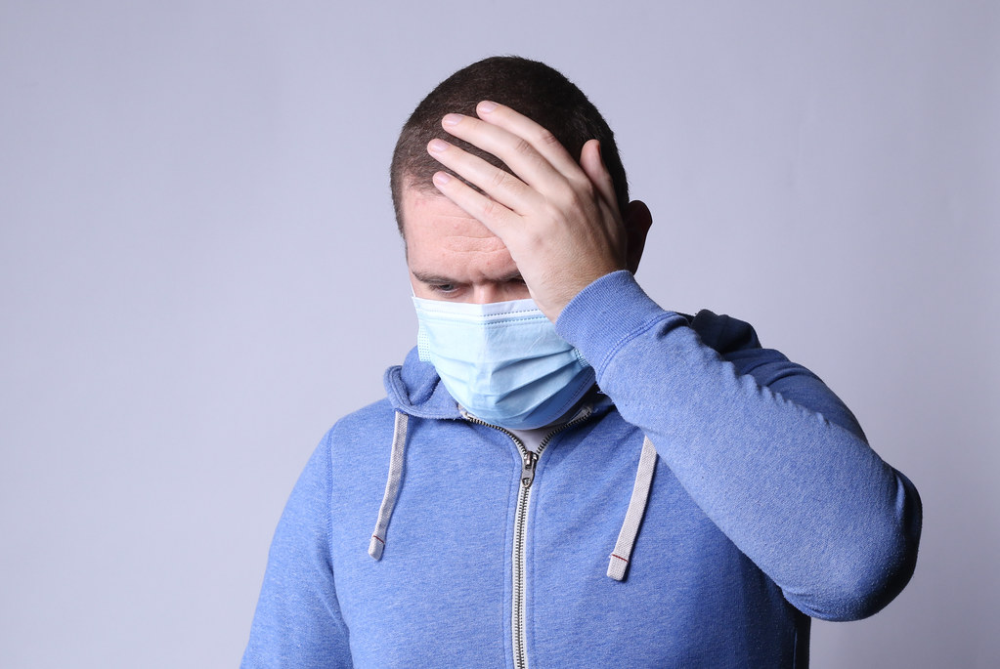

# What to do if you get sick in Germany

If you get sick in Germany, it is important to know what steps to take to get the medical care you need. Here are some things you can do if you get sick in Germany:

## Seek medical attention
If you are feeling seriously ill or have a medical emergency, it is important to seek medical attention as soon as possible. You can call an ambulance by dialing 112 or go to the nearest hospital or medical clinic. Even if your symptoms are minor, it is still a good idea to have them checked out by a medical professional.

## Consult a doctor or pharmacist
If you have a minor illness or are unsure about what to do, you can consult a doctor or pharmacist for advice. In Germany, you do not need a referral to see a doctor, and you can visit a pharmacy without a prescription to get over-the-counter medications. If you are unable to see a doctor or pharmacist in person, you can also seek advice through telemedicine services.

## Know your insurance coverage
If you are seeking medical treatment in Germany, it is important to know your insurance coverage. Germany has a public healthcare system that is funded by taxes, but you may also have private insurance through your employer or through a private provider. It is a good idea to familiarize yourself with your insurance coverage so that you know what is and is not covered.

## Follow the treatment plan
If you are prescribed medications or told to follow a specific treatment plan, it is important to follow it as directed. Failure to do so could result in your symptoms not improving or getting worse. If you have any concerns about your treatment plan or medications, be sure to discuss them with your doctor or pharmacist.

## Take care of yourself
In addition to following your treatment plan, it is important to take care of yourself while you are sick. This might include things like getting plenty of rest, eating well, and staying hydrated. You should also try to avoid activities that could make your symptoms worse or expose others to your illness (e.g. if you have a contagious illness).

## Conclusion
If you get sick in Germany, it is important to seek medical attention and follow a treatment plan to help you recover. By consulting a doctor or pharmacist, knowing your insurance coverage, and taking care of yourself, you can get the medical care you need and get back to feeling your best.