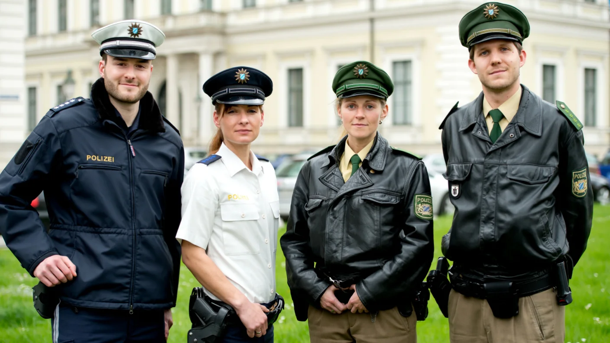

# How to Communicate with the Police in Germany

If you are a young person who has recently relocated or are traveling in Germany, it is important to know how to communicate with the police in case you find yourself in a situation where you need their assistance or have to interact with them. Here are some tips to keep in mind:

## Know your rights
As a resident or visitor in Germany, you have certain rights when interacting with the police. It is important to know these rights so that you can assert them if necessary. Here are some key points to remember:

- You have the right to remain silent. You do not have to answer questions or provide any information to the police unless you are under arrest or are required to do so by law (e.g. if you are involved in a traffic accident).
- You have the right to a lawyer. If you are arrested or detained, you have the right to have a lawyer present during questioning. You also have the right to remain silent until you have consulted with a lawyer.
- You have the right to an interpreter. If you do not speak German, you have the right to have an interpreter present during questioning or any other interaction with the police.

## Be respectful and polite
Even if you are asserting your rights, it is important to be respectful and polite when interacting with the police in Germany. Police officers in Germany generally have a high level of authority and are respected members of the community, so it is important to show them the same level of respect that you would show to any other authority figure.

## Use clear and concise language
When communicating with the police, it is important to use clear and concise language. This will help to ensure that you are understood and that the police are able to understand your situation or request for assistance. If you do not speak German fluently, it may be helpful to have a friend or translator present to help communicate with the police.

## Follow the instructions of the police
If the police give you instructions or orders, it is important to follow them. Failure to do so could result in legal consequences or a worsening of the situation. If you have concerns about the instructions or orders being given to you, you can raise them with the police at a later time or seek legal advice.

## Stay calm and keep your cool
If you find yourself in a situation where you are interacting with the police, it is important to stay calm and keep your cool. Getting agitated or upset will not help the situation and may make things worse. Take deep breaths, try to stay focused, and remember that the police are there to help you.

## Seek help if you need it
If you are arrested or detained by the police in Germany, you have the right to a lawyer and to an interpreter. If you do not have a lawyer or do not know how to contact one, you can ask the police to provide you with a list of lawyers or refer you to legal aid. If you are a foreign national, you may also be able to contact your embassy for assistance.

## Conclusion
Communicating with the police in Germany can be intimidating, especially if you are not familiar with the language or the legal system. However, by knowing your rights, being respectful and polite, using clear and concise language, and following the instructions of the police, you can improve your chances of having a positive interaction with the police.

For more information on your rights when interacting with the police in Germany, you can refer to the [Federal Ministry of Justice and Consumer Protection's website](https://www.bmjv.de/EN/Topics/Police/police_node.html).
