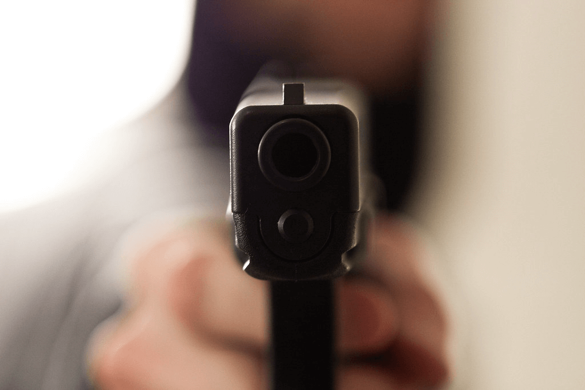

# I was robbed or attacked in Germany, what should I do?

If you have been the victim of a robbery or attack in Germany, it is important to know what steps to take to protect your safety and seek help. Here are some things you can do if you have been robbed or attacked in Germany:

## Call the police
If you have been robbed or attacked, the first thing you should do is call the police. In Germany, you can reach the police by dialing 110. When you call the police, be sure to provide them with your location and a description of the incident. The police will dispatch an officer to your location to assist you.

## Seek medical attention
If you have been injured in the attack or robbery, it is important to seek medical attention as soon as possible. You can call an ambulance by dialing 112 or go to the nearest hospital or medical clinic. Even if your injuries are minor, it is still a good idea to have them checked out by a medical professional.

## Collect evidence and make a report
If you are able to do so, it can be helpful to collect evidence of the attack or robbery. This might include things like torn clothing, bruises or cuts, or any items that were stolen. If you have a camera or smartphone with you, you can also take pictures of the scene or your injuries. It is also a good idea to make a report of the incident to the police. This will help to document what happened and may be used as evidence in any legal proceedings.

## Contact your embassy or consulate
If you are a foreign national who has been attacked or robbed in Germany, it is a good idea to contact your embassy or consulate for assistance. They can provide you with support and guidance on what to do next.

## Seek support and counseling
Being the victim of a robbery or attack can be a traumatic experience. If you are feeling overwhelmed or distressed, it is important to seek support and counseling. You can contact organizations like the Federal Association for Victim Assistance or Victim Support Germany for help.

## Take steps to protect your safety
After a robbery or attack, it is important to take steps to protect your safety. This might include things like changing your routine, being more aware of your surroundings, and staying in well-lit areas. If you are living in a place where you do not feel safe, you may want to consider moving to a safer location.

## Conclusion
If you have been the victim of a robbery or attack in Germany, it is important to take action to protect your safety and seek help. By calling the police, seeking medical attention, collecting evidence, and seeking support and counseling, you can begin to recover from the incident and move forward.